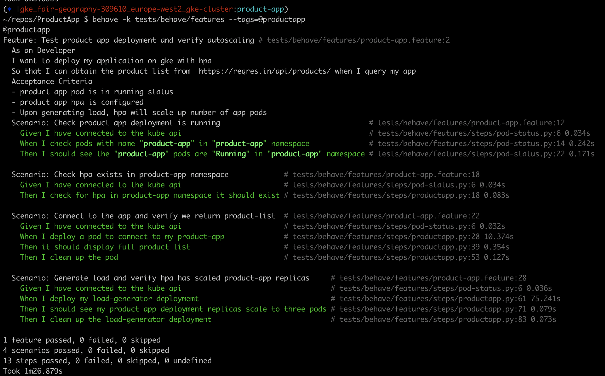

# ProductApp

The code in this repository will create a GKE cluster via terraform and deploy a containerised application via cloud builder and helm v3.

# How to use this repository

This repo is split in 4 phases, each contained within the following folders:

1) cluster - containing our terraform configuration files for spinning up a new network and deploying a regional GKE cluster within it
2) app - contains our application code and Dockerfile to build our application container image
3) chart - contains our helm chart for our app deployment onto Kubernetes
4) tests - contains our BDD tests for verifying our app and resources have been deployed successfully and able to autoscale in response to increased demand

## Pre-requisites

### GCP Auth

Before we can get started, you will need to create a service account in gcloud with permissions to create vpcs and build GKE clusters. Create a key for this service account and download the `.json` file. Then take the contents from the `.json` file and and add it to `cluster/auth/svc.json`. This is how we will authenticate with the gcp api, which will allow terraform to spin up the resources.

### Remote state storage set-up

Within our `cluster` folder we have a `state-file-storage` folder. This contains code for a one time gcs bucket creation, to be used to store our GKE cluster's state file. If you already have a bucket that you can use for this, please ignore this folder, and jump to the [create cluster step](#create-cluster).

cd into the `cluster/state-file-storage` and set default values for the below in the `variables.tf` file:
```
define GCP project name
variable "gcp_project" {
 type        = string
 description = "GCP project name"
}

variable "bucket-name" {
  type        = string
  description = "The name of the Google Storage Bucket to create"
}
```

Then run the below to create bucket for remote state storage:
```
terraform init

terraform apply
```

## Create Cluster

Firstly we need to set-up a new vpc and networks in gcloud. To do this follow the below steps, from the root of this directory:
```
1. cd cluster

2. Ensure the below variable for project is set in variables.tf:

# define GCP project name
variable "gcp_project" {
  type        = string
  default     = "<your-gcp-project>"
  description = "GCP project name"
}

3. Ensure to add your newly created bucket name or existing bucket name in backend.tf:

terraform {
  backend "gcs" {
    bucket      = "<your-bucket-name>"
    prefix      = "gke-cluster/terraform-state.tfstate"
    credentials = "./auth/svc.json"
  }
}

4. Set gcp project in provider settings also:

provider "google" {
  credentials = "auth/svc.json"
  project     = "<your-gcp-project>"
  region      = "europe-west2"
}

5. terraform init

6. terraform apply
```
This will create 5 resources in total, at the end of which you will have a regional GKE cluster up and running.

## Build and deploy app

Next we use cloud builder to build our app image, push to our private gcr repo and deploy our app on our newly created GKE cluster. *Please ensure your gcloud cli has been configured and cloudbuild service account has appropriate permissions to deploy applications and its resources to the GKE cluster.*

First set the env var `$GCP_PROJECT` which contains your gcp project id. Also update gcp project id in the image value in `chart/product-app/values.yaml` as below:
```
image:
  repository: gcr.io/<your_gcp_project>/product-app
```

Then from the root of the directory run:
```
gcloud builds submit
```
## Testing

Now that we have everything set-up and deployed, we can test our app has been configured correctly and that autoscaling is working.

### Manual testing

We can quickly test by hand the app accepts responses from https://reqres.in/api/products/, and displays complete list of products. 

Firstly login to the GKE cluster:
```
gcloud container clusters get-credentials gke-cluster --region europe-west2
```
Next check our app is running:
```
$ kubectl get po

NAME                                     READY   STATUS    RESTARTS   AGE
product-app-deployment-db55db748-59dnf   1/1     Running   0          4h5m
```
Then we can port-forward traffic from the pod to our local machine as so:
```
$ kubectl port-forward pod/product-app-deployment-db55db748-59dnf 5000:5000
```
Then curl the endpoint, or load up in your browser to check we get the full list of products:
```
curl -s http://localhost:5000/product-list/

[
    {
        "color": "#98B2D1",
        "id": 1,
        "name": "cerulean",
        "pantone_value": "15-4020",
        "year": 2000
    },
    {
        "color": "#C74375",
        "id": 2,
        "name": "fuchsia rose",
        "pantone_value": "17-2031",
        "year": 2001
    },
    {
        "color": "#BF1932",
        "id": 3,
        "name": "true red",
        "pantone_value": "19-1664",
        "year": 2002
    },
    {
        "color": "#7BC4C4",
        "id": 4,
        "name": "aqua sky",
        "pantone_value": "14-4811",
        "year": 2003
    },
    {
        "color": "#E2583E",
        "id": 5,
        "name": "tigerlily",
        "pantone_value": "17-1456",
        "year": 2004
    },
    {
        "color": "#53B0AE",
        "id": 6,
        "name": "blue turquoise",
        "pantone_value": "15-5217",
        "year": 2005
    }
]
```

### Automated testing

We can also automatically test the above plus the autoscaling of our app. The tests folder contains some BDD tests for our application using [behave](https://behave.readthedocs.io/en/stable/) which gives us a framework through which we can write our tests in python.

Once authenticated to the cluster and have installed the `behave` cli, run the below command from the root of the directory:
```
$ behave tests/behave/features --tags=@productapp
```
This will run through the different scenarios and if all tests pass will give you an output as below:



In brief the tests check for:

* If the product app exists and is in running state
* HPA object exist
* Connect to product app and confirm we get the full product list
* Deploy 15 pods all making requests to the app to generate load
* Confirm product app has scaled to 3 replicas in response to increase in the number of requests

## Improvements

Further improvement could be made, such as to expose the app outside of the cluster by creating an ingress object in conjunction with setting up DNS to direct queries to the GKE cluster ingress controller. Furthermore setting up tls certificates for our ingress. We can also automate the build, deploy, test process end to end by creating a CICD pipeline. Also we could add build triggers so that we can trigger builds whenever a commit is made. Add github actions to improve CI process such as running `terraform fmt` and `terraform validate` on push.  
